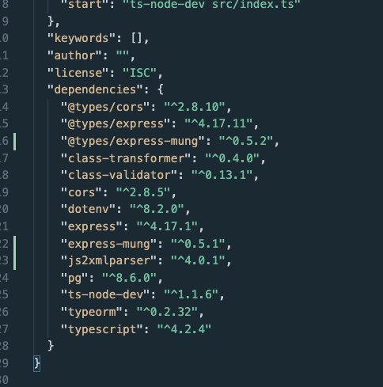

# validaciones
Para las validaciones 
https://www.npmjs.com/package/class-validator

Para crear validaciones:
https://www.npmjs.com/package/class-validator#custom-validation-classes

express-mung

This package allows synchronous and asynchronous transformation of an express response. This is a similar concept to the express middleware for a request but for a response. Note that the middleware is executed in LIFO order. It is implemented by monkey patching (hooking) the res.end, res.json, or res.write methods.

https://www.npmjs.com/package/express-mung 
```npm install express-mung --save```

https://www.npmjs.com/package/@types/express-mung
```npm i @types/express-mung```


js2xmlparser
js2xmlparser is a Node.js module that parses JavaScript objects into XML.
https://www.npmjs.com/package/js2xmlparser
```npm i js2xmlparser```



