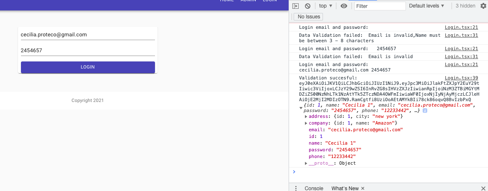

# Connecting express-app and react-app for deployment(production)
link the node proyect with react: We have to configure the node server to an static file 

We are going to build the react aplication for deployment:
```MacBook-Air-de-MAC:react-app mac$ npm run build```

We are going to find a directory called build:


The statics files of the commonmiddleware have to come frome the previous directory(build):
look at route.middleware.ts 

When we try to run it , we want to both aplications have the same domain, so we are going to work with the axios file

```//No me gustaria comocar mi link en cada uno 
import axios, { AxiosInstance, AxiosRequestConfig, AxiosResponse } from 'axios';

const instance:AxiosInstance = axios.create({
    // baseURL:'https://jsonplaceholder.typicode.com'
    // baseURL:'http://127.0.0.1:3111'  We dont need it, integrated in the package.json

```

and adding to the package.json 

```   "development": [
      "last 1 chrome version",
      "last 1 firefox version",
      "last 1 safari version"
    ]
  },
  "proxy":"http://127.0.0.1:3111"
}
// proxy should be the same as express app
```

build it again (react-app): 
```MacBook-Air-de-MAC:react-app mac$ npm run build```

Openning th node app, and running it:


Comprobando en postman y en aplicacion :


# SEGUNDA PARTE 
Como se vio anteriormente ya tenemos agregado el endpoint api/posts , agregaremos el correspondiente a users , pero el codico no esta preparado para las relaciones, ya que se encuentra para entidades simples como posts:
```
create=async(data:any)=>{
        const newItem = getRepository(this.entity).create( data );
        let [item, error] = await handleAsync(getRepository(this.entity).save(newItem));

        if (error) return new Error(error.message);
        return item;
    }
    find=async( )=>{
        let [items, error] = await handleAsync(getRepository(this.entity).find());
         if (error) return new Error(error.message);
         return items;

    }
    findOne=async(id:string)=>{
        let [item, error] = await handleAsync(getRepository(this.entity).findOne(id));
    
         if (error) return new Error(error.message);
         return item;
    }
    update=async(id:string, data:any)=>{
        let [response, error] = await handleAsync(getRepository(this.entity).update(id, data));
        if (error) return new Error(error.message);

        let [updatedItem, error2] = await handleAsync(getRepository(this.entity).findOne(id));
        if (error2) return new Error(error.message);
        return updatedItem;
```
Crearemos otro archivo para user.service.ts ,ya que nos hacen falta las relaciones...

{
    "name":"Cecilia",
    "email":"cecilia.proteco@gmail.com",
    "password":"2454657",
    "phone": "12233442",
    "address":{
        "city":"new york"
    },
    "company":{
        "name":"Amazon"
    }
}

{
    "userId":1,
    "title":"ceciiiii ",
    "body":"kckbckjdbcjd kdc kdjhcdjc djck jdcd kcjdc dkd cd"
}

Obtenemos :


Vamos a cambiar y a borrar algunos archivos, por el cascade, se borra de las otras listas ya que esta ligado con el id:


