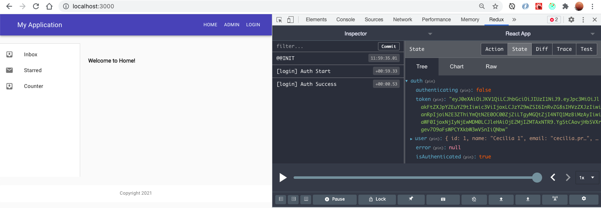

# Ocupando el middleware y haciendo validaciones


## Haciendo validaciones
Las validaciones se hacen cuando mandas cosas en el body 
Using some libraries in express :

Allows use of decorator and non-decorator based validation. Internally uses validator.js to perform validation. Class-validator works on both browser and node.js platforms.

https://www.npmjs.com/package/class-validator
```npm i class-validator```

https://www.npmjs.com/package/class-transformer
```npm i class-transformer```


